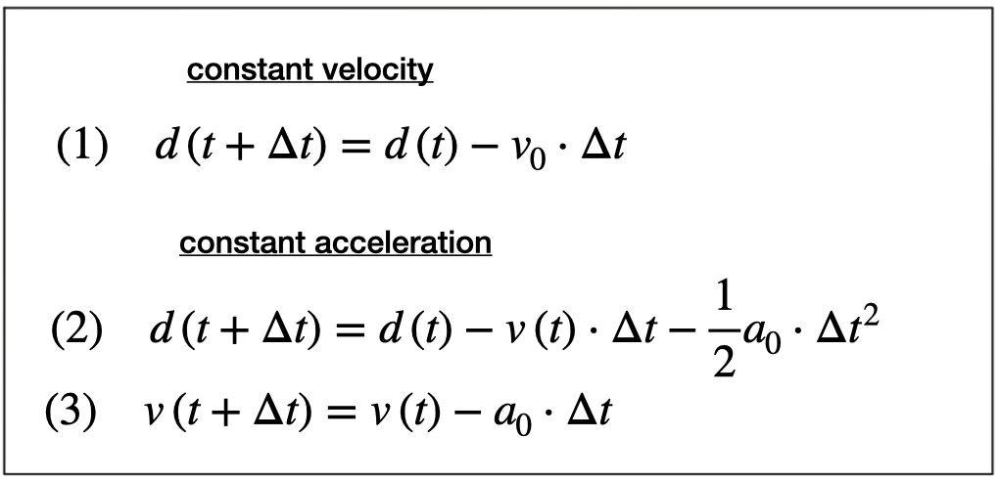
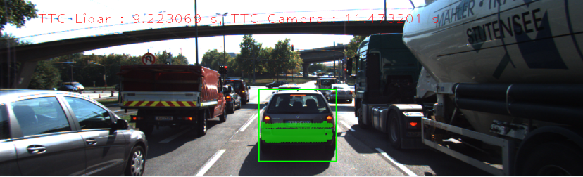

# SFND 3D Object Tracking

Welcome to the final project of the camera course. By completing all the lessons, you now have a solid understanding of keypoint detectors, descriptors, and methods to match them between successive images. Also, you know how to detect objects in an image using the YOLO deep-learning framework. And finally, you know how to associate regions in a camera image with Lidar points in 3D space. Let's take a look at our program schematic to see what we already have accomplished and what's still missing.

<p align="center">

</p>


In this final project, you will implement the missing parts in the schematic. To do this, you will complete four major tasks: 

1. First, you will develop a way to match 3D objects over time by using keypoint correspondences.
2. Second, you will compute the TTC based on Lidar measurements. 
3. You will then proceed to do the same using the camera, which requires to first associate keypoint matches to regions of interest and then to compute the TTC based on those matches. 
4. And lastly, you will conduct various tests with the framework. Your goal is to identify the most suitable detector/descriptor combination for TTC estimation and also to search for problems that can lead to faulty measurements by the camera or Lidar sensor. In the last course of this Nanodegree, you will learn about the Kalman filter, which is a great way to combine the two independent TTC measurements into an improved version which is much more reliable than a single sensor alone can be. But before we think about such things, let us focus on your final project in the camera course. 

## Dependencies for Running Locally
* cmake >= 2.8
  * All OSes: [click here for installation instructions](https://cmake.org/install/)
* make >= 4.1 (Linux, Mac), 3.81 (Windows)
  * Linux: make is installed by default on most Linux distros
  * Mac: [install Xcode command line tools to get make](https://developer.apple.com/xcode/features/)
  * Windows: [Click here for installation instructions](http://gnuwin32.sourceforge.net/packages/make.htm)
* Git LFS
  * Weight files are handled using [LFS](https://git-lfs.github.com/)
  * Install Git LFS before cloning this Repo.
* OpenCV >= 4.1
  * This must be compiled from source using the `-D OPENCV_ENABLE_NONFREE=ON` cmake flag for testing the SIFT and SURF detectors.
  * The OpenCV 4.1.0 source code can be found [here](https://github.com/opencv/opencv/tree/4.1.0)
* gcc/g++ >= 5.4
  * Linux: gcc / g++ is installed by default on most Linux distros
  * Mac: same deal as make - [install Xcode command line tools](https://developer.apple.com/xcode/features/)
  * Windows: recommend using [MinGW](http://www.mingw.org/)

## Basic Build Instructions

1. Clone this repo.
2. Make a build directory in the top level project directory: `mkdir build && cd build`
3. Compile: `cmake .. && make`
4. Run it: `./3D_object_tracking`.

# Final Report

The sections below discuss how each of topics of interest was addressed in the Project. Topics discussed are:
1. 3D objects matching
2. LIDAR based Time-To-Collision Computation
3. Association of Keypoint Correspondences with Bounding Boxes
4. Camera based Time-To-Collision Computation
5. LIDAR based TTC performance evaluation
6. Camera based TTC performance evaluation

## FP.1 3D Objects Matching

For the purpose of matching 3D objects function 
```cpp 
void matchBoundingBoxes(std::vector<cv::DMatch> &matches, std::map<int, int> &bbBestMatches, DataFrame &prevFrame, DataFrame &currFrame)
```
was implemented.

The objective is to match bounding boxes produced by YOLO based object detection across different frames. To achieve this we used the information we receive from when frames are processed using Computer Vision techniques. This means that each frame was processed by a pipeline consisting of:
1. Keypoints detector
2. Descriptors detector
3. Keypoints matcher

This produces keypoints matched across 2 subsequent frames and this information can be used to match Bounding Boxes.

```cpp     
    std::multimap<int, int> bounding_boxes_matches;
    std::set<int> prev_frame_box_in_kpt;    
    int values_num = 0;
```

First for every match we will find the keypoint on the previous and on the current frame
 ```cpp   
    for (auto it= matches.begin(); it < matches.end(); it++)
    {
        // for every match there are 2 keypoints. Find by all bounding boxes enclosing the keypoints in previous and current image
        // and put them in the multimap
        cv::KeyPoint keypoint_match_prev_frame = prevFrame.keypoints[it->queryIdx]; // keypoint matched on the previous frame
        cv::KeyPoint keypoint_match_curr_frame = currFrame.keypoints[it->trainIdx]; // keypoint matched on the current frame
```
In the next step we will check if the 2 keypoints are located within the region of interest of bounding boxes associated to frames during YOLO object detection. First we go through the bounding boxes in the previous frame and check the Region-Of-Interest. If the keypoint is found within a bounding box on the previous frame we will search if the corresponding matched keypoint can be found in one of the bounding boxes associated to the current frame. If that is the case, we can claim that the 2 bounding boxes can consitute a match and we will put their IDs into a multimap.
```cpp
       
        for (auto it_p = prevFrame.boundingBoxes.begin(); it_p < prevFrame.boundingBoxes.end(); it_p++)
        {
            if(it_p -> roi.contains(keypoint_match_prev_frame.pt))
            {
                for (auto it_c = currFrame.boundingBoxes.begin(); it_c < currFrame.boundingBoxes.end(); it_c++)
                {
                    if(it_c -> roi.contains(keypoint_match_curr_frame.pt))
                    {
                        prev_frame_box_in_kpt.insert(it_p->boxID);
                        bounding_boxes_matches.insert({it_p->boxID, it_c->boxID});
                        values_num = std::max(it_c->boxID, values_num);
                    }             
                }
            }             
        }
    }
```
After we have all the Bounding Boxes match candidates in the multimap, we need to find the best matches. This is done by going thogh all the unique previous frame bounding box IDs in stored in the ```
std::set<int> prev_frame_box_in_kpt;   ```

A helper vector ```std::vector<int> maxID (values_num + 1, 0);``` is declared and defined as having a size equal to the highest current frame box ID (position of the Bounding Box in the vector of bonding boxes defined in the DataFrame structure) that is one of the best match candidates and initialized to all zeros.

For each unique previous frame box ID we look at the set of all the Bounding Boxes associated to it in the current frame and store the number of times they occured in the helper vector. When we have proccessed all the current frame Bounding Box IDs (values) that are associated with the previous frame Bounding Box ID (key) we are looking at, we will look for the Bounding Box that occured the most times. That box will be the second element in the our bbBestMatches.
```cpp
  
    for(auto it = prev_frame_box_in_kpt.begin(); it != prev_frame_box_in_kpt.end(); it++ )
    {
        std::vector<int> maxID (values_num + 1, 0);
        for(auto it_mm = bounding_boxes_matches.equal_range(*it).first; it_mm != bounding_boxes_matches.equal_range(*it).second; ++it_mm )
        {
            maxID[(*it_mm).second]++;  
        }

        int mode = distance(maxID.begin(), max_element(maxID.begin(), maxID.end()));
        bbBestMatches.insert({*it, mode});      
}
```
When we loop over all the unique Bounding Box IDs found in the previous frame and for each find the most occuring Bounding Box ID in the current frame we will have the bbBestMatches set we are looking for which means we have matched the detected 3D objects across 2 frames.

## FP.2 LIDAR based Time-To-Collision Computation

In this section we will discuss the approach taken to compute the Time-To-To Collision using the LIDAR point cloud. 

Time-To-Collison is the duration until the collision with the preceeding Vehicle whose speed is lower than the Vehicle calculating the TTC. Time-To-Collision information can be used in Advanced Driver Assistance Systems (ADAS) such as Forward Collision Warning (FCW) and Collision Avoidance System (CAS). We will calculate it base on distance information we get from the LiDAR point cloud but other sensor technologies can also be used. Later in the report we will discuss how to calculate TTC using a monocamera.

<p align="center">

</p>
<p align="center">
Traffic scenario
</p>

In the case of LIDAR we have to model the Vehicle motion so the TTC information can be calculated with distance to obstacle and time between successive measurements used as inputs. To model the Vehicle motion correctly some simplifying assumption have to be taken: We can either assume that relative to the Vehicle calculating the TTC,
1. The preceeding Vehicle speed is constant, or
2. The preceeding Vehicle deceleration is constant.

<p align="center">

</p>
<p align="center">
Motion models
</p>

Since in this project we are have a limited set of input images we will assume that the preceeding Vehicle speed is constant in order to simplify our model. This model cannot be used in production systems since it can introduce significant error is situations where the preceeding Vehicle is strongly breaking for example and usually in production system the constant acceleration model is used.

<p align="center">

</p>
<p align="center">
LIDAR TTC calculation approach
</p>

As it can be seen in the image above to calculate the TTC we will measure distance d0 to the preceeding Vehicle in the t0 instance and the distance d1 in the t1 instance and use it as inputs to the Constant Velocity Model presented by the equations below:

<p align="center">

</p>
<p align="center">
TTC calculation equations
</p>

### FP.2.1 Implementation
TTC calculation was implemented in the function ``` void computeTTCLidar(std::vector<LidarPoint> &lidarPointsPrev, std::vector<LidarPoint> &lidarPointsCurr, double frameRate, double &TTC_v0)```. It takes as input LIDAR points associated with the Bounding Box found in the previous and in the current frame.

```cpp
    double dT = 1/frameRate;
    double laneWidth = 4;
    float clusterTolerance = 0.04;
    int minSize = 50; 
    int minXCurr_count = 0;
    int minXPrev_count = 0;

    double minXPrev = 1e9, minXCurr = 1e9;

    std::vector<LidarPoint> lidarPointsPrevFiltered = FilterOutliers(lidarPointsPrev, clusterTolerance, minSize);
    std::vector<LidarPoint> lidarPointsCurrFiltered = FilterOutliers(lidarPointsCurr, clusterTolerance, minSize);

    for (auto it = lidarPointsPrevFiltered.begin(); it != lidarPointsPrevFiltered.end(); ++it)
        minXPrev = ((minXPrev > it->x) && (abs(it->y) <= laneWidth/2))? it->x : minXPrev;


    for (auto it = lidarPointsCurrFiltered.begin(); it != lidarPointsCurrFiltered.end(); ++it)
       minXCurr = ((minXCurr > it->x) && (abs(it->y) <= laneWidth/2)) ? it->x : minXCurr;

    std::cout << "Previos distance to the car: " << minXPrev << std::endl;
    std::cout << "Currrent distance to the car: " << minXCurr << std::endl;
    TTC_v0 = minXCurr * dT / (minXPrev - minXCurr);
```
The entire approach is based on taking the closest point on the X-axis in two successive instances and calculating the TTC. 
Since the input cloud has artefacts that can influence the accuracy of the measurement the cloud is first filtered for outlier points. For this purpose the Euclidean Clustering algorithm developed as a part of the LIDAR Obstacle Tracking Project was reused and was implemented within the ```std::vector<LidarPoint> FilterOutliers(std::vector<LidarPoint> &lidarPoints, float clusterTolerance, int minSize)```. Each LIDAR point vector for clusters by inserting every LIDAR point into a KD Tree and the doing a search of the tree with Cluster Tolerance set to 0.04 (maximum distance allowed between 2 neighbouring LIDAR points in order for them to be considered a part of a single cluster) and Minimum Cluster size set to 50 points.

## FP.3 Associating Keypoint Correspondences with Bounding Boxes
This section describes the how the keypoint correspondences are associated with Bounding Boxes. This is done because before a TTC estimate using monocamera can be computed, it is necessary to find all keypoint matches belonging to each 3D object.

This is implemented in function ```void clusterKptMatchesWithROI(BoundingBox &boundingBox, std::vector<cv::KeyPoint> &kptsPrev, std::vector<cv::KeyPoint> &kptsCurr, std::vector<cv::DMatch> &kptMatches)``` which uses as parameters a 3D object Bounding Box associated to the current data frame, vector of keypoints detected on previous and on current frame and a vector of matches.

Algorithm first loops over all the keypoint matches and for each match checks if the matched keypoint on the current frame is located within the Bounding Box Region-Of-Interest. If it is 
then distance between this keypoint and a corresponding matched keypoint on a previous frame is calculated and used for mean distance calculation. A pair of Keypoint match and a calculated distance is created and pushed into a helper vector.
```cpp
   double dist, sum, mean_distance = 0;
    vector<pair<cv::DMatch, double>> distance;

    for(auto it = kptMatches.begin(); it < kptMatches.end(); it++)
    {
        if(boundingBox.roi.contains(kptsCurr[it->trainIdx].pt))
        {
            pair<cv::DMatch, double> pair;
            dist = cv::norm(kptsCurr[it->trainIdx].pt - kptsPrev[it->queryIdx].pt);
            pair.first = (*it);
            pair.second = dist;
            distance.push_back(pair);
            sum += dist;         
        }            
    }
    mean_distance = sum / distance.size(); 
```
Second part of the algorithm involves looping over all the elements that are in the helpler vector and checking if the distance associated with a particulat keypoints match is shorter than the calculated mean distance x ratio. The keypoint with a shorter distance is pushed into a vector that is a part of a Bounding Box structure.  
```cpp
    for (auto it = distance.begin(); it != distance.end(); it++)
    {   
        if((*it).second < mean_distance * 1.3)
            boundingBox.kptMatches.push_back((*it).first);
    }
```

## FP.4 Camera based Time-To-Collision Computation

Besides the LIDAR base TTC, a camera based TTC estimation was also implemented in the scope of the project. For this purpose we took the already available series of images coming from a monocamera used in the other parts of the project. Monocular cameras are not able to measure metric distances. They are passive sensors that rely on the ambient light which reflects off of objects into the camera lens. It is thus not possible to measure the runtime of light as with Lidar technology. To measure distance, a second camera would be needed. Given two images taken by two carefully aligned cameras (also called a stereo setup) at the same time instant, one would have to locate common points of interest in both images (e.g. the tail lights of the preceding vehicle) and then triangulate their distance using camera geometry and perspective projection.

Despite the limitations it is still posible to measure the distance using a monocamera due to the fact that we can associate a change in object distance with the change in size of object projection on a camera sensor. In the following figure, you can see how the height H of the preceding vehicle can be mapped onto the image plane using perspective projection. We can see that the same height H maps to different heights h0 and h1 in the image plane, depending on the distance d0 and d1 of the vehicle. It is obvious that there is a geometric relation between h, H, d and the focal length f of the pinhole camera.

<p align="center">

</p>
<p align="center">
Motion models
</p>


Based on this we can derive following equations:
<p align="center">

</p>
<p align="center">
TTC computation modelling using a monocamera
</p>

In the project this was implemented in the function ```void computeTTCCamera(std::vector<cv::KeyPoint> &kptsPrev, std::vector<cv::KeyPoint> &kptsCurr, std::vector<cv::DMatch> kptMatches, double frameRate, double &TTC_v0, cv::Mat *visImg)``` where vectors of Keypoints on previous and current frame, a vector of Matches from the Bounding box structure associated with the current frame, as well as the frame rate were passed as inputs for the TTC computation.

The algorithm will loop over the vector of Matches, trying to find the pairs of inner and outer keypoints that are then used in scale change calculation which produces a distance_ratio vector:
```cpp
    for(auto it1 = kptMatches.begin(); it1 != kptMatches.end() - 1; it1++)
    {   // outer keypoint loop
        // get current keypoint and its matched partner in the previous frame
        cv::KeyPoint kpOuterCurr = kptsCurr.at(it1->trainIdx);
        cv::KeyPoint kpOuterPrev = kptsPrev.at(it1->queryIdx);

        for (auto it2 = kptMatches.begin() + 1; it2 != kptMatches.end(); it2++)
        {   // inner keypoint look
            double minDist = 100.0; // min. required distance

            // get next keypoint and its matched partner in the prev frame
            cv::KeyPoint kpInnerCurr = kptsCurr.at(it2->trainIdx);
            cv::KeyPoint kpInnerPrev = kptsPrev.at(it2->queryIdx);

            // compute distances and distancee ratios
            double distCurr = cv::norm(kpOuterCurr.pt - kpInnerCurr.pt);
            double distPrev = cv::norm(kpOuterPrev.pt - kpInnerPrev.pt);

            if (distPrev > std::numeric_limits<double>::epsilon() && distCurr >= minDist)
            {   // avoid division by zero
                double distRatio = distCurr / distPrev;
                distRatios.push_back(distRatio);
            }
        } // eof inner loop over all matched kpts
    }     // eof outer loop over all matched kpts
```
From the distance ratio vector we then find a median distance and calculate the TTC:
```cpp
   sort(distRatios.begin(), distRatios.end());

    if (distRatios.size() % 2 == 0)
        medianDistRatio = (distRatios[distRatios.size() / 2] + distRatios[(distRatios.size() / 2) + 1]) / 2;
    
    else
        medianDistRatio = distRatios[(distRatios.size() + 1) / 2];

    TTC_v0 = - dT / (1 - medianDistRatio);
```

## FP.5 LIDAR based TTC performance evaluation

In this section LIDAR performance is discussed. When comparing the LIDAR and CAMERA based TTC estimation we can see some deviation for the LIDAR side.

<p align="center">

</p>
<p align="center">
Example 1
</p>

<p align="center">

</p>
<p align="center">
Example 2
</p>

Reasons for this can be:
* LIDAR artefacts that are not removed even after applying the filtering coming from laser ray bouncing off exhaust smoke etc.
* Noise susceptible measurement approach - the smallest variation of measurement between 2 successive measurements strongly influences the TTC computation accuracy.
* Only 2 frames are used for distance calculation. Exploring the use of more frames, or interleaving them might result in more consistent computation results.
* Poor syncing between LIDAR and Camera images and not taking into account the movement of the ego vehicle 

## FP.6 Camera based TTC performance evaluation

To evaluate Camera based TTC performance the pipeline was executed for most of the Detector/Descriptor combinations. Average TTC, MinimumTTC and Maximum TTC were evaluated. 

<p align="center">
 
| Desc.\Det. | SHITOMASI | HARRIS | FAST | BRISK | ORB | AKAZE | SIFT |
| ------ | ------ | ------ | ------ |------ | ------ | ------ |------ |
| BRISK|13.4891  |-inf|13.303|14.0049|39.8402|12.4057|12.0114 | 
| BRIEF |12.1029  |8.01195|12.0458|14.9032|21.5782|12.497|11.89145|
| ORB | 11.5568|-inf|11.5554|13.8099|17.6789|12.4282|Out Of Memory
| FREAK |12.6304  |-inf|12.5335|14.2398|-inf|12.2216|11.7513
| AKAZE  |n/a  |n/a|n/a|n/a|n/a|12.433|n/a

</p>
<p align="center">
Average TTC
</p>

<p align="center">
 
| Desc.\Det. | SHITOMASI | HARRIS | FAST | BRISK | ORB | AKAZE | SIFT |
| ------ | ------ | ------ | ------ |------ | ------ | ------ |------ |
| BRISK|9.94909 |-inf|10.1057|9.41747|8.29001|8.94665|8.75213|
| BRIEF |8.22875  |-29.5616|9.92931|9.5707|8.37783|8.84252|8.61572|
| ORB | 8.02661 |-inf|9.18883|9.70919|8.46717|8.77253|Out Of Memory
| FREAK |10.6551  |-inf|10.2745|8.8529|-inf|8.94208|8.61572
| AKAZE  | n/a |n/a|n/a|n/a|n/a|9.00531|n/a

</p>
<p align="center">
Minimum TTC
</p>

<p align="center">
 
| Desc.\Det. | SHITOMASI | HARRIS | FAST | BRISK | ORB | AKAZE | SIFT |
| ------ | ------ | ------ | ------ |------ | ------ | ------ |------ |
| BRISK|35.5348 |284.161|16.5077|25.3548|427.443|16.2011|19.4978|
| BRIEF |15.2359 |34.7543|13.7671|25.8674|70.7145|15.7351|21.7907|
| ORB | 13.992 |18.2178|14.369|20.5613|30.9371|15.948|Out Of Memory
| FREAK |  19.2777 |70.3024|15.7363|23.8766|186.726|15.6829|19.6764
| AKAZE  | n/a |n/a|n/a|n/a|n/a|16.4965|n/a

</p>
<p align="center">
Maximum TTC
</p>

Detector/Descriptor combination which were identified as the Top 3 best performing are also in accordance with the results of the in the [2D Features Tracking Project](https://github.com/davorrr/SFND_2D_Feature_Tracking/):
* FAST/BRIEF 
* FAST/ORB
* FAST/FREAK


|  | Average TTC | Minimum TTC | Maximum TTC |
| ------ | ------ | ------ | ------ |
| FAST/BRIEF |12.0458  |9.92931|13.7671|
| FAST/ORB | 11.5554 |9.18883|14.369|
| FAST/FREAK | 12.5335 |10.2745|15.7363|

The poorest performing, still functional Detector/Descriptor combination are mainly those with ORB and to a lesser degree with BRISK used as detectors. 
The poor results might be explained with: 
* a lower amount of detected keypoints and matches that these combinations produce when compared with the best performing ones. 
* Poor distribution of detected keypoints on the Vehicle when ORB detector is used.

This leads to them not being able to be filtered out / averaged by the pipeline as efficiently as the TOP 3 combinations which then leads to very unreliable results. 
